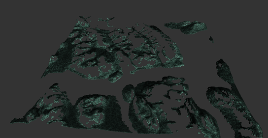
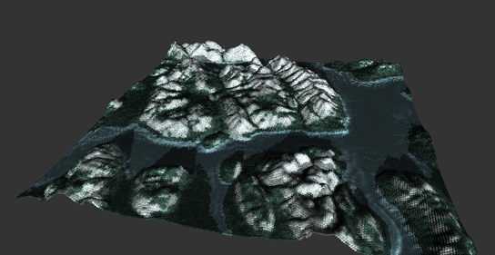

<header>

</header>

Projet de M2 (2018).
<h3>Buts du projet: (En cours)</h3>
* Manipuler le pipeline OpenGL
* Voxelliser un terrain et l'analyser pour une visualisation adaptée

Code: C++ / OpenGL - GLSL 3.3 

 
Etapes obligatoires:
* Découper le terrain en régions -> clipping des régions visibles
* Analyse et tri par -matière- (texture) suivant certains critères (pente, hauteur...)
* Affichage par matière, régions
* Calcul et affichage de la shadowMap
* Ajouts de textures billboard (non implémenté)
* Optimisation GL4 (compute shader) (non implémenté)

Améliorations personnelles:

* Modèle de lumière différent par matière (shader)
* Modèle d'eau évolué:
    * Texture de reflexion/refraction (Fresnel effect)
    * Distortion tiling avec une du/dv map
    * Utilisation d'une normal map pour les reflets
* Ajout d'une cubemap/skybox
* ...

    <video width="560" height="315" controls>
    <source src="assets/video/waterfinal.mp4" type="video/mp4">
    Your browser does not support the video tag.
    </video>

 

Affichage par régions et calcul de la shadowMap 

 

Tri et affichage par matières (textures)  

 

