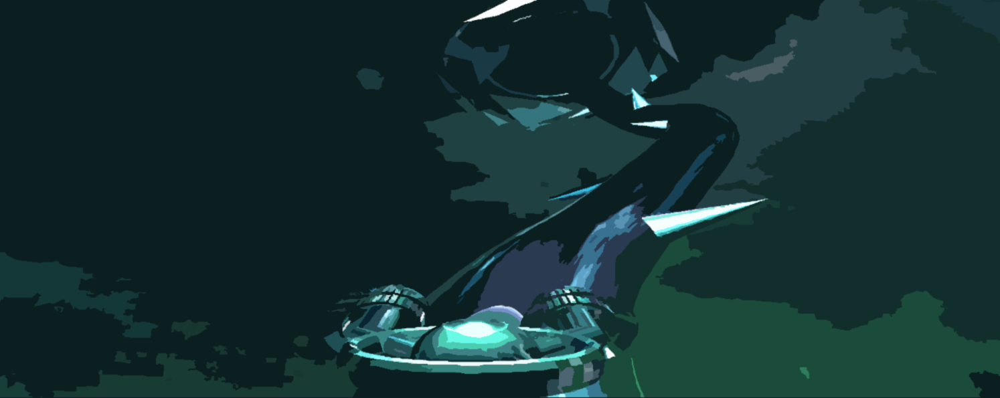

<header>

</header>

Projet de M1 (2018).
<h3>Buts du projet: </h3>
* Implémenter un jeu de runner 'infini' avec un tuyau généré aléatoirement
* Implémenter les collisions, modèle de lumière...

Code: C++ / Framework OpenGL - GLSL 3.3

    <video width="560" height="315" controls>
    <source src="assets/video/pipeRunner.mp4" type="video/mp4">
    Your browser does not support the video tag.
    </video>

 

<h3>Principe du jeu:</h3>
Obtenir un score maximal. 
Il est possible de tourner autour du tuyau (gauche et droite) pour éviter les obstacles. 
Chaque checkpoint (triple anneau jaune) rajoute un point. 
Le nombre d'obstacles par chunk (entre 2 checkpoints jaunes) augmente à chaque checkpoint passé (maximum: 20).

 

 

Génération du tuyau :
* Génération de points le long d'un vecteur aléatoirement altéré
* Calcul de la courbe par algorithme de Chaikin
* Calcul des normales et rotations des segments
* Génération du tube grâce aux normales

Shaders :
* Affichage de la cubemap
* Modèle de rendu général: 
Blinn-Phong, B.Walter modifié pour le halo du vaisseau,  mélange de réfraction et réflexion suivant des critères de visibilité (fog et angle de vision)

Vaisseau, checkpoints et double-torus (rajoutant les obstacles au loin) créés sous Blender.
