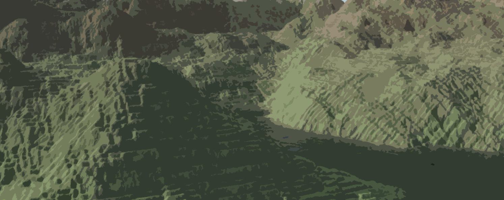
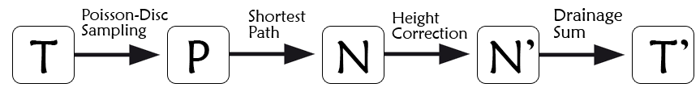
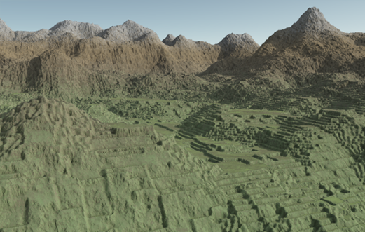
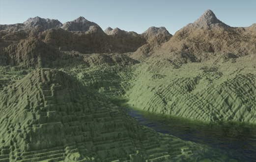
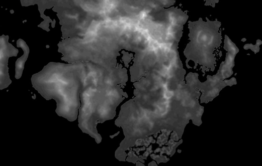
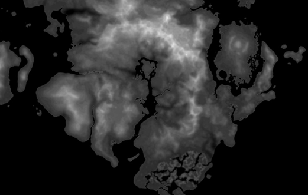
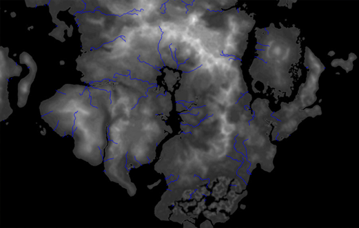

<header>

</header>

Projet de M1 (2018), binôme et tuteuré.
<h3>But du projet: </h3>
* Initiation à la recherche
* Générer de manière procédurale un réseau de rivières réaliste sur un terrain (heightmap) quelconque

Code: C++ / QT

    <video width="560" height="315" controls>
    <source src="assets/video/rivieres.mp4" type="video/mp4">
    Your browser does not support the video tag.
    </video>

 

Pipeline de génération 

 

<h3>Résultats avant-après: (Visualisation sous Terragen)</h3>

 

 

  
<object data="assets/images/poster_14_eymard_peuriere.pdf" width="1000" height="1000" type='application/pdf'/>

