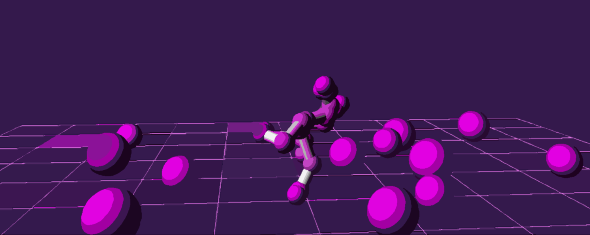
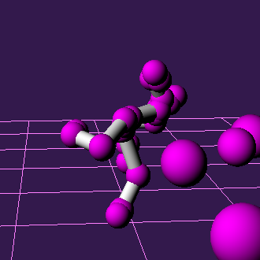
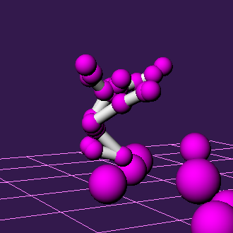

<header>

</header>

Projet de M1 (2018).
<h3>Buts du projet:</h3>
* Implémenter l'animation de personnage
* Implémenter des interactions physiques (gravité, shallow water equations, système masse-ressort, collisions, système solaire...)

Code: C++ / Framework OpenGL

    <video class='image left' width="560" height="315" controls>
    <source src="assets/video/ani.mp4" type="video/mp4">
    Your browser does not support the video tag.
    </video>

    <video width="560" height="315" controls>
    <source src="assets/video/sw.mp4" type="video/mp4">
    Your browser does not support the video tag.
    </video>

 

 

 
Animation de personnage par fichier BVH. 
Gestion des enchaînements avec un graphe d'états (marcher, courrir...). 
Interactions physiques (application de forces) avec les particules/ressorts.

