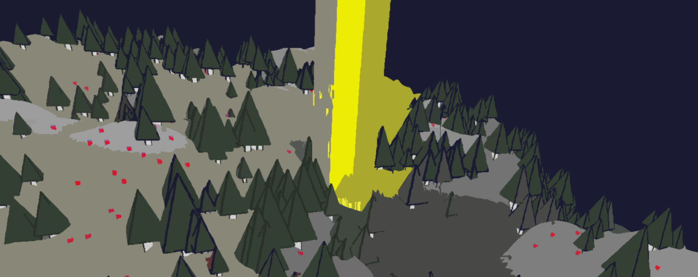
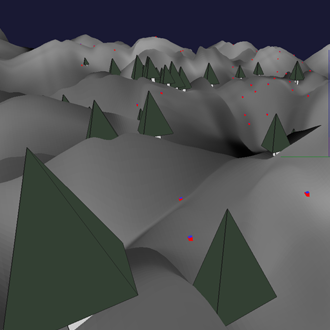
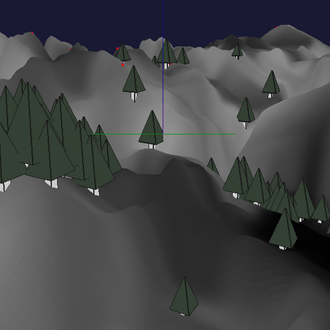
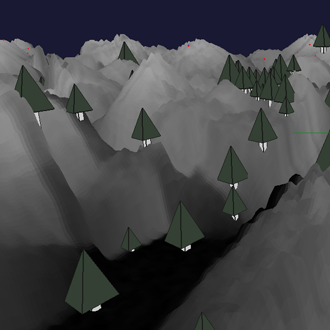
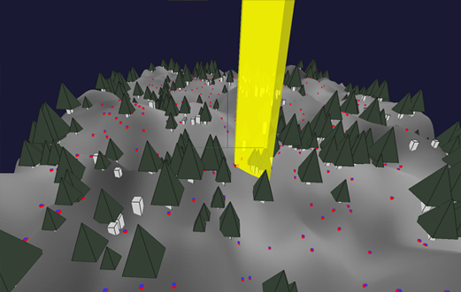
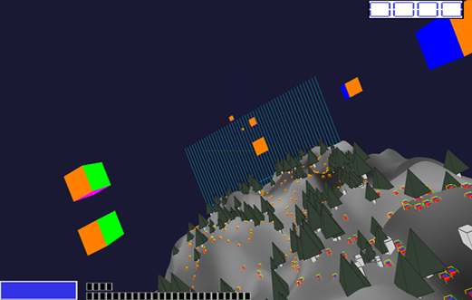
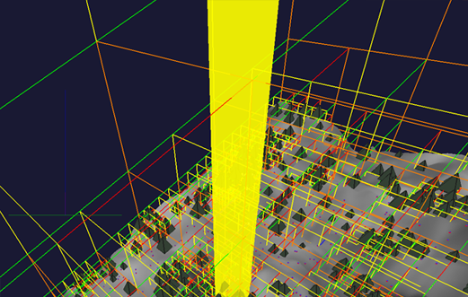
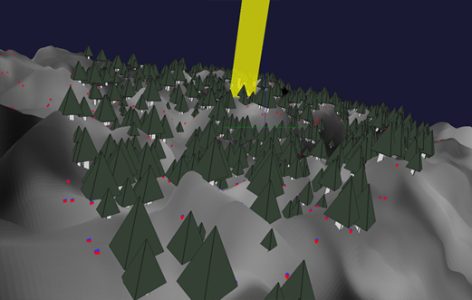

<header>

</header>

Projet de L3 (2017), binôme.
<h3>Buts du projet:</h3>
* Réaliser un jeu 3D avec génération aléatoire du terrain
* Implémenter le clipping par octree

Code: C / OpenGL 1

    <video width="560" height="315" controls>
    <source src="assets/video/fm.mp4" type="video/mp4">
    Your browser does not support the video tag.
    </video>

 

<h3>Principe du jeu:</h3>
Obtenir un score maximal. 
Un point par collision vaisseau-ennemi(dommageable) ou munition-ennemi, le jeu s'arrête quand le joueur n'a plus de vie. 
Le joueur doit atterrir pour ramasser d'autres munitions. 
 

Terrain aléatoire (et paramétrable), arbres destructibles. 

 

 
6 déplacements possibles:
* Tangage gauche - droite
* Monter - Descendre
* Tourner gauche - droite

* Accélérer - Décélérer

 
Simulation de gravité: les munitions retombent, les ennemis touchés chutent, la vitesse augmente lorsqu'on se dirige vers le sol.

Implémentation du clipping des objets par octree (accentué ici pour être visible) 

